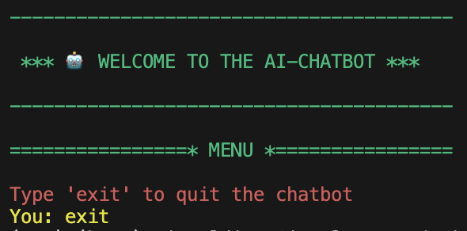

# Project: Build an AI-Chatbot



## Project Overview

I will be building a custom chatbot using OpenAI. I will use the OpenAI API to generate explanations based on code blocks in multiple programming languages like a software engineer.

## Requirements: Installation & Setip

#### Packages:

- OpenAI: [OpenAI](https://python.langchain.com/docs/integrations/platforms/openai) is a Python library that provides a simple interface to the OpenAI API. It also provides a command-line interface (CLI) for interacting with the API.

## Create and activate a virtual environment

#### MacOs/Linux:

```py
# Create environment
python3 -m venv env
```

```py
# Activate environment
source env/bin/activate
```

## Installation

#### MacOs/Linux:

```py
pip3 install -r requirements.txt
pip3 install streamlit-chat
```

## API Keys

### Set the key as an environment variable:

```py
export OPENAI_API_KEY='sk-foij....4hi3hi3j5h'
```

.env file:

```py
OPENAI_API_KEY='sk-foij....4hi3hi3j5h'
```

## Start the application

```py
streamlit run main.py
```
